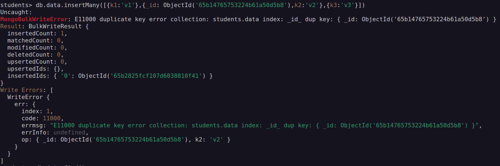
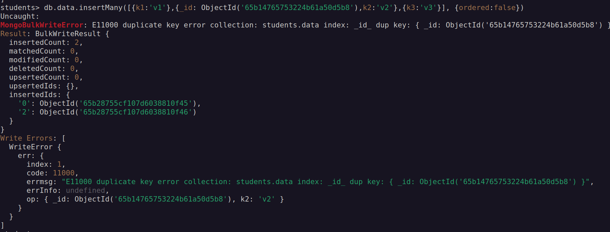

# Basic queries

- Mongod server-

  - Check server status- `sudo systemctl status mongod`
  - Start the server- `sudo systemctl start mongod`
  - Stop the server- `sudo systemctl stop mongod`

- Mongo shell- `mongosh`
- Show-
  - Show databases- `show dbs`
  - Show collections- `show collections`
- Switch to particular database- `use <db-name>`

## Create, Delete, Insert, Read

- Create-

  - Create and switch to new db- `use <new-db-name>`
    > NOTE: until there's a collection inside a db, the db won't be exist/shown
  - Create new collection- `db.createCollection('<collection-name>')`
  - Create new collection and add new documents- `db.<new-collection-name>.insertOne({doc})`

- Delete-

  - Delete collection- `db.<collection-name>.drop()`
  - Delete db- `db.dropDatabase()` (while being on the db to be dropped)

- Insert-

  - Insert one document- `db.<collection-name>.insertOne({k1:v1, k2:v2})`
  - Insert many document at once- `db.<collection-name>.insertMany([{k1:v1}, {k2:v2}, {k3:v3}])`

    #### Ordered Insert

    Meaning the insertion of documents would be in ordered manner, if there is an error with one document while inserting in bulk, then the rest of the documents after it would not get inserted.
    

    #### Unordered Insert

    All documents would be inserted except the document with the error.
    

    > NOTE: Default insertion is `Ordered Insertion`. To change it to `Unordered`, do this- `db.<collection-name>.insertMany([{doc1, doc2, ...}], {ordered: false})`

- Read-
  - find all docs- `db.<collection-name>.find()`
  - find all docs with given key:value pair- `db.<collection-name>.find({k1:v1})` will look for all the document with the matching key and value.
  - find single, first doc with given key:value pair- `db.<collection-name>.findOne({k1:v1})`
  - find all documents with specific key in it- `db.<collection>.find({}, {quiz:1, _id:0})` (`_id:0`, would remove the default ids that are shown)

## Import and Export JSON

> NOTE: mongoimport is a terminal command, not a mongo shell command

- Import-
  - If JSON file have just multiple docs/objects- `mongoimport /path/to/jsonfile/test.json -d <new-or-existing-db-name> -c <new-or-existing-collectionName>`
    > If the file is an array of docs/objects, then add `--jsonArray` as argument
  - Imports are limited to maximum of 16MB
- Export-  
   `mongoexport -o /path/to/jsonfile/test.json -d  <db-name> -c <collection-name>`- all the documents inside the specified collection would be exported to the new specified file

## Cursor methods

Mongodb retrieves query results in batches using the cursors.  
Cursors are just pointers to the result set on the server.

- Automatic batching- Mongodb retrieves query results in batches and the default batch size is 101

<u>Some cursor methods</u>-
`limit()` `count()` `skip()` `sort()`

<u>Some examples</u>-  
`db.<collection>.find({price:{$ne: 50}}).count()`  
`db.<collection>.find().limit(5)`  
`db.<collection>.find().limit(5).skip(2)` will skip top 2  
`db.<collection>.find({value:{$gt:70}}).limit(5).sort({price:1})` 1 for ascending, -1 for descending

## Operators

- Comparision Operators - `$eq`, `$ne`,`$gt`,`$gte`,`$lt`,`$lte`,`$in`,`$nin`  
  Uses-
  ```js
  db.<collection>.find({value: {$ne: 12}})
  db.<collection>.find({price: {$nin: [1,2,3,5]}})
  ```
- Logical operators- `$and` `$or` `$nor` `$not`
  Uses-
  ```js
  db.<collection>.find({$and:[{condition1},{condition2},...]}) //can also be written as- `find({condition1 , condition2})` (mongodb would implicitly treats this as AND operation)
  db.<collection>.find({$not:{key:value}})
  ```

# Complex expression-

`db.prices.find({$expr: {$gt:['$price', 50]}})`- in the array the first value is the key to be checked and the second value is the value to be compared with

`db.prices.find({$expr: {$lt:[{$add:['$quantity','$price']}, '$totalPrice']}}, {_id:0})` - show all the docs whose sum of 'quantity' and 'price' is less than 'totalPrice' of the same doc

`db.prices.find({$expr: {$gt:[{$multiply:['$quantity','$price']}, '$totalPrice']}}, {_id:0})` - show all the docs whose multiplication result of 'quantity' and 'price' field is greater than the 'totalPrice' field of the same doc

# Elements Operator

1. `$exists`- shows the doc based on the given boolean condition of '$exists' on a field/key

    some examples- 
    - `find({price:{$exists:true}})` - will show only those doc
  with key as 'price'
    - `db.prices.find({quantity:{$exists: true, $gt: 40}})` - will only show if the 'quantity' field exists and is greater than 40
2. `$type` - will filter out the data based of the BSON data type of a field.
    - 'BSONtype' values can be of following type- 
    > NOTE: the numberings of the datatype are predefined and we can either use these number of exact datatype 
    
    | Type | Number | Alias |
    | --- | --- | --- |
    | Double | 1 | "double"|
    |String  |2 | "string"|
    |Object |3 | "object"|
    |Array |4 | "array"|
    |Binary data|5 | "binData"|
    |Undefined|6 | "undefined" **(DEPRECATED)**|
    |ObjectID |7 | "objectId"|
    |Boolean |8 | "bool"|
    |Date|9 | "date"|
    |Null |10 | "null"|
    and so on ...


3. `$size`
